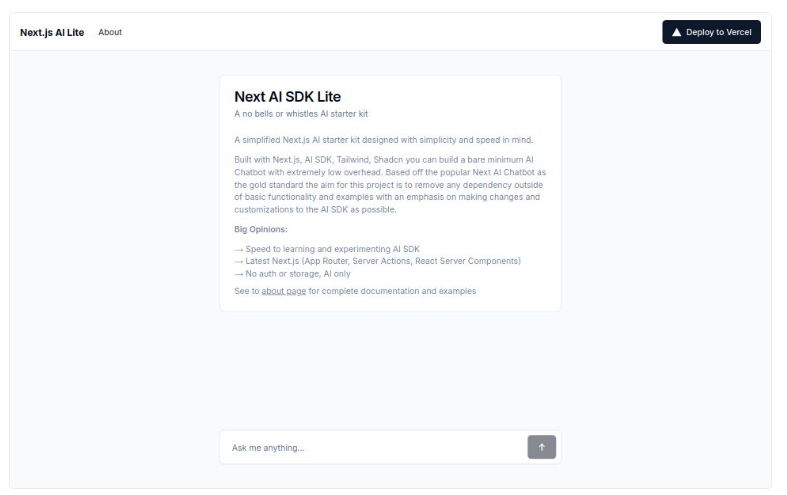

# 🛡️ Data Analysis RBAC Agent

AI-powered **data analysis agent** with **Role-Based Access Control (RBAC)**, hosted on **AWS**.

This is a **monorepo** containing both the backend and frontend, built with **Next.js**.

---

## 🚀 Getting Started

This project is bootstrapped with [Next.js](https://nextjs.org/) and designed for rapid experimentation with the **AI SDK**.

### Development

1. **Install dependencies:**
   ```bash
   npm install
   # or
   yarn install
   # or
   pnpm install
   # or
   bun install
   ```

2. **Run the development server:**
   ```bash
   npm run dev
   # or
   yarn dev
   # or
   pnpm dev
   # or
   bun dev
   ```
   Open [http://localhost:3000](http://localhost:3000) in your browser.

3. **Edit the frontend:**
   - Modify [`src/app/page.tsx`](src/app/page.tsx). The page auto-updates as you edit.

4. **Fonts:**
   - Uses `next/font` to automatically optimize and load Inter (Google Font).

---

## 📊 Dataset Requirements (Retail Sector)

To power the data analysis agent, use datasets that meet these requirements:

- **Multi-table:** e.g., sales, inventory, products, customers, stores, (optionally employees/promotions)
- **Realistic:** Order-level detail, product/category/customer/store info, time/date fields
- **Format:** CSV (preferred) or other easy-to-import formats for Postgres/SQL
- **Size:** Thousands of records, multiple years if possible
- **Documentation:** Basic table and column descriptions

### Example Datasets

- [Cleaned Contoso Dataset (Kaggle)](https://www.kaggle.com/datasets)
- [DemoData.ai Retail Demo Data](https://demodata.ai/)
- [Retail Sales Analysis SQL Project (GitHub - najirh)](https://github.com/najirh/retail-sales-analysis)
- [SQL Retail Data Analysis (GitHub - Mahanteshrn)](https://github.com/Mahanteshrn/SQL-Retail-Data-Analysis)
- [Sample Sales Data (Kaggle)](https://www.kaggle.com/datasets)
- [ContosoTR (Kaggle)](https://www.kaggle.com/datasets)

---

## 📚 Learn More

- [Next.js Documentation](https://nextjs.org/docs) — Features and API
- [Learn Next.js](https://nextjs.org/learn) — Interactive tutorial
- [Next.js GitHub Repository](https://github.com/vercel/next.js) — Feedback and contributions welcome!

---

## ☁️ Deploy on Vercel

The easiest way to deploy your Next.js app is via the [Vercel Platform](https://vercel.com/) from the creators of Next.js.

See the [Next.js deployment documentation](https://nextjs.org/docs/deployment) for more details.

---

